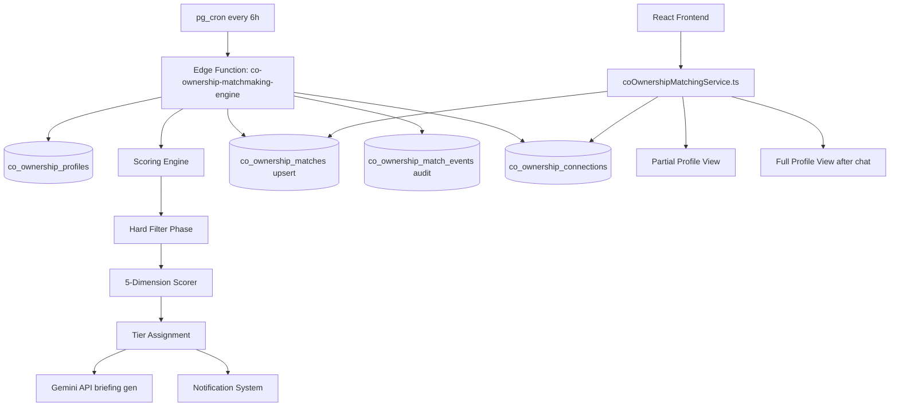

# Design Document: Co-Ownership Matchmaking Engine

## Overview

The Co-Ownership Matchmaking Engine is a scheduled background system that computes compatibility scores between active co-ownership profiles, stores ranked match pairs, generates AI-written briefings for strong matches, and surfaces results to users through a privacy-preserving reveal model.

The system operates on a **Complementary Financial Partnership Model**: it rewards pairs where one partner's financial strengths offset the other's weaknesses, rather than simply matching similar profiles. A user with high income but low savings is ideally paired with a user who has high savings but moderate income — together they can achieve what neither could alone.

The engine runs as a Supabase Edge Function triggered by pg_cron every 6 hours. It uses the service role key to bypass RLS, processes all active profiles, applies hard filters, scores viable pairs across five weighted dimensions, calls Gemini for AI briefings on strong matches, and upserts results into persistent tables. The frontend queries these pre-computed results via RLS-protected tables.

---

## Architecture



**Data flow per run:**
1. Fetch all active profiles (`is_active = true`)
2. Generate all N*(N-1)/2 unique unordered pairs
3. Apply hard filters — eliminate ineligible pairs
4. Score each surviving pair across 5 dimensions (0–100 total)
5. Assign score tier; discard pairs below 45
6. For pairs ≥ 75: call Gemini for two perspective-specific briefings
7. Upsert results into `co_ownership_matches`
8. Send in-app notifications for pairs ≥ 75 (skip if already notified at same tier)
9. Update `co_ownership_match_events` with run statistics

---

## Components and Interfaces

### Edge Function: `co-ownership-matchmaking-engine`

**File:** `supabase/functions/co-ownership-matchmaking-engine/index.ts`

Triggered by pg_cron (not browser). No CORS headers. Uses service role key.

```typescript
import { serve } from "https://deno.land/std@0.168.0/http/server.ts";
import { createClient } from "https://esm.sh/@supabase/supabase-js@2";
import { logger } from "../_shared/logger.ts";

serve(async (req) => {
  const supabase = createClient(
    Deno.env.get("SUPABASE_URL")!,
    Deno.env.get("SUPABASE_SERVICE_ROLE_KEY")!
  );
  const geminiApiKey = Deno.env.get("GEMINI_API_KEY")!;

  // 1. Create Match_Event record with status "running"
  // 2. Fetch active profiles
  // 3. Generate pairs, apply hard filters
  // 4. Score each pair
  // 5. Generate AI briefings for score >= 75
  // 6. Upsert matches, send notifications
  // 7. Update Match_Event with final counts
});
```

**Key internal functions:**

```typescript
// Fetch all active profiles with completeness >= 40
async function fetchEligibleProfiles(supabase): Promise<CoOwnershipProfile[]>

// Generate all unique unordered pairs
function generatePairs(profiles: CoOwnershipProfile[]): [CoOwnershipProfile, CoOwnershipProfile][]

// Apply hard filters; returns { surviving, filteredCounts }
function applyHardFilters(pairs): { surviving: Pair[]; filteredCounts: FilterCounts }

// Compute full score for a pair
function scorePair(a: CoOwnershipProfile, b: CoOwnershipProfile): ScoredPair

// Assign tier from total score
function assignTier(score: number): ScoreTier | null  // null if < 45

// Generate Gemini briefing for one perspective
async function generateBriefing(
  subject: CoOwnershipProfile,
  match: CoOwnershipProfile,
  score: ScoredPair,
  apiKey: string
): Promise<string | null>

// Send in-app notification (uses existing notifications table)
async function sendMatchNotification(
  supabase,
  userId: string,
  matchUserId: string,
  tier: ScoreTier,
  briefingSummary: string
): Promise<void>
```

---

### Service: `coOwnershipMatchingService.ts`

**File:** `src/services/coOwnershipMatchingService.ts`

```typescript
// Returns matches for the current user, partial profile only (no financial details)
export async function getMyMatches(userId: string): Promise<PartialMatchResult[]>

// Returns full profile for a specific match (only after connection is active_chat)
export async function getFullMatchProfile(
  userId: string,
  matchUserId: string
): Promise<FullMatchResult | null>

// Initiates a connection (creates co_ownership_connections row)
export async function initiateConnection(
  userId: string,
  matchUserId: string
): Promise<Connection>

// Updates connection state (declined, blocked, active_chat)
export async function updateConnectionState(
  connectionId: string,
  userId: string,
  newState: ConnectionState
): Promise<void>

// Returns connections for the current user
export async function getMyConnections(userId: string): Promise<Connection[]>
```

**Privacy enforcement** — `getMyMatches` strips sensitive fields at the service layer:

```typescript
function toPartialProfile(profile: CoOwnershipProfile): PartialProfile {
  // Omit: annual_income, down_payment, credit_score_range, budget_min, budget_max
  // Include: age_range, occupation, why_co_ownership, preferred_locations,
  //          co_ownership_purposes, living_arrangements
  // Approximate budget: round to nearest $50K
  const approxBudget = {
    min: Math.round(profile.budget_min / 50000) * 50000,
    max: Math.round(profile.budget_max / 50000) * 50000,
  };
  return { ...safeFields, approxBudget };
}
```

---

### Frontend Components

**`src/pages/dashboard/CoOwnershipMatches.tsx`**
- Main matches page; fetches from `getMyMatches()`
- Renders a list of `<MatchCard>` components sorted by score descending
- Shows connection state badges (pending, active, declined)

**`src/components/co-ownership/MatchCard.tsx`**
- Displays partial profile: age range, occupation, why_co_ownership, approx budget, locations, purposes, living arrangements
- Shows compatibility score + tier badge
- "Connect" button calls `initiateConnection()`
- "Decline" button calls `updateConnectionState(..., 'declined')`

**`src/components/co-ownership/CompatibilityBreakdown.tsx`**
- Visual score breakdown across 5 dimensions
- Progress bars for each dimension score vs. max
- Shows AI briefing text (for score ≥ 75)
- Shows gap analysis text (for score 45–74)

---

## Data Models

### SQL Schema

#### `co_ownership_matches`

```sql
CREATE TABLE co_ownership_matches (
  id                        UUID PRIMARY KEY DEFAULT gen_random_uuid(),
  user_id_1                 UUID NOT NULL REFERENCES auth.users(id) ON DELETE CASCADE,
  user_id_2                 UUID NOT NULL REFERENCES auth.users(id) ON DELETE CASCADE,

  -- Canonical ordering enforced by CHECK constraint
  CONSTRAINT chk_canonical_order CHECK (user_id_1 < user_id_2),
  CONSTRAINT uq_match_pair UNIQUE (user_id_1, user_id_2),

  -- Scores
  total_score               NUMERIC(5,2) NOT NULL CHECK (total_score >= 0 AND total_score <= 100),
  score_tier                TEXT NOT NULL CHECK (score_tier IN ('exceptional', 'strong', 'good', 'possible')),

  -- Dimension scores
  financial_score           NUMERIC(5,2) NOT NULL CHECK (financial_score >= 0 AND financial_score <= 35),
  property_score            NUMERIC(5,2) NOT NULL CHECK (property_score >= 0 AND property_score <= 25),
  structure_score           NUMERIC(5,2) NOT NULL CHECK (structure_score >= 0 AND structure_score <= 25),
  quality_score             NUMERIC(5,2) NOT NULL CHECK (quality_score >= 0 AND quality_score <= 10),
  bonus_score               NUMERIC(5,2) NOT NULL CHECK (bonus_score >= 0 AND bonus_score <= 5),

  -- Sub-scores stored for breakdown UI
  sub_scores                JSONB NOT NULL DEFAULT '{}',
  -- Shape: { budget_overlap, down_payment_comp, income_comp, credit_compat,
  --          location_overlap, property_type_overlap, timeline_alignment,
  --          ownership_split, living_arrangement, purpose_alignment }

  -- AI content
  ai_briefing_user_1        TEXT,
  ai_briefing_user_2        TEXT,
  gap_analysis              TEXT,

  -- Metadata
  computed_at               TIMESTAMPTZ NOT NULL DEFAULT now(),
  notified_at               TIMESTAMPTZ,
  notified_tier             TEXT,

  -- Indexes
  created_at                TIMESTAMPTZ NOT NULL DEFAULT now()
);

CREATE INDEX idx_matches_user1 ON co_ownership_matches(user_id_1);
CREATE INDEX idx_matches_user2 ON co_ownership_matches(user_id_2);
CREATE INDEX idx_matches_score ON co_ownership_matches(total_score DESC);
```

#### `co_ownership_connections`

```sql
CREATE TABLE co_ownership_connections (
  id              UUID PRIMARY KEY DEFAULT gen_random_uuid(),
  user_id_1       UUID NOT NULL REFERENCES auth.users(id) ON DELETE CASCADE,
  user_id_2       UUID NOT NULL REFERENCES auth.users(id) ON DELETE CASCADE,
  initiated_by    UUID NOT NULL REFERENCES auth.users(id),
  state           TEXT NOT NULL DEFAULT 'pending_chat'
                  CHECK (state IN ('pending_chat', 'active_chat', 'declined', 'blocked')),
  education_sent  BOOLEAN NOT NULL DEFAULT false,
  created_at      TIMESTAMPTZ NOT NULL DEFAULT now(),
  updated_at      TIMESTAMPTZ NOT NULL DEFAULT now(),

  CONSTRAINT uq_connection_pair UNIQUE (user_id_1, user_id_2),
  CONSTRAINT chk_connection_order CHECK (user_id_1 < user_id_2)
);

CREATE INDEX idx_connections_user1 ON co_ownership_connections(user_id_1);
CREATE INDEX idx_connections_user2 ON co_ownership_connections(user_id_2);
```

#### `co_ownership_match_events`

```sql
CREATE TABLE co_ownership_match_events (
  id                        UUID PRIMARY KEY DEFAULT gen_random_uuid(),
  run_id                    UUID NOT NULL DEFAULT gen_random_uuid(),
  trigger_type              TEXT NOT NULL DEFAULT 'scheduled' CHECK (trigger_type IN ('scheduled', 'manual')),
  status                    TEXT NOT NULL DEFAULT 'running'
                            CHECK (status IN ('running', 'completed', 'failed')),
  started_at                TIMESTAMPTZ NOT NULL DEFAULT now(),
  completed_at              TIMESTAMPTZ,

  -- Counts
  total_active_profiles     INTEGER,
  total_pairs_evaluated     INTEGER,
  total_pairs_filtered      INTEGER,
  filter_counts             JSONB DEFAULT '{}',
  -- Shape: { inactive, low_completeness, no_budget_overlap }
  total_pairs_scored        INTEGER,
  total_matches_stored      INTEGER,
  total_notifications_sent  INTEGER,
  total_briefings_generated INTEGER,

  error_message             TEXT,
  created_at                TIMESTAMPTZ NOT NULL DEFAULT now()
);

-- Retention: auto-delete events older than 90 days via pg_cron or a scheduled job
CREATE INDEX idx_match_events_started ON co_ownership_match_events(started_at DESC);
```

### TypeScript Types

```typescript
// Mirrors co_ownership_profiles table (existing)
interface CoOwnershipProfile {
  id: string;
  user_id: string;
  budget_min: number;
  budget_max: number;
  down_payment: number;
  annual_income: number;
  credit_score_range: string; // e.g. "700-749", "750+", "flexible"
  property_types: string[];
  preferred_locations: string[];
  min_bedrooms: number;
  purchase_timeline: string; // "0-3 months" | "3-6 months" | "6-12 months" | "12+ months"
  ownership_split: string;   // "50/50" | "60/40" | "70/30" | "flexible"
  living_arrangements: string[];
  co_ownership_purposes: string[];
  age_range: string;
  occupation: string;
  why_co_ownership: string;
  profile_completeness: number;
  is_active: boolean;
}

type ScoreTier = 'exceptional' | 'strong' | 'good' | 'possible';

interface ScoredPair {
  profile1: CoOwnershipProfile;
  profile2: CoOwnershipProfile;
  totalScore: number;
  tier: ScoreTier;
  financialScore: number;
  propertyScore: number;
  structureScore: number;
  qualityScore: number;
  bonusScore: number;
  subScores: SubScores;
}

interface SubScores {
  budgetOverlap: number;
  downPaymentComp: number;
  incomeComp: number;
  creditCompat: number;
  locationOverlap: number;
  propertyTypeOverlap: number;
  timelineAlignment: number;
  ownershipSplit: number;
  livingArrangement: number;
  purposeAlignment: number;
}

type ConnectionState = 'pending_chat' | 'active_chat' | 'declined' | 'blocked';

interface Connection {
  id: string;
  user_id_1: string;
  user_id_2: string;
  initiated_by: string;
  state: ConnectionState;
  education_sent: boolean;
  created_at: string;
  updated_at: string;
}

// Partial profile — safe to show before connection
interface PartialProfile {
  userId: string;
  ageRange: string;
  occupation: string;
  whyCoOwnership: string;
  approxBudgetMin: number;  // rounded to nearest $50K
  approxBudgetMax: number;
  preferredLocations: string[];
  coOwnershipPurposes: string[];
  livingArrangements: string[];
}

interface PartialMatchResult {
  matchId: string;
  totalScore: number;
  tier: ScoreTier;
  financialScore: number;
  propertyScore: number;
  structureScore: number;
  qualityScore: number;
  bonusScore: number;
  subScores: SubScores;
  aiBriefing: string | null;
  gapAnalysis: string | null;
  partialProfile: PartialProfile;
  connectionState: ConnectionState | null;
}
```

---

## Scoring Algorithm (Pseudocode)

### Hard Filters

```typescript
function applyHardFilters(pairs: Pair[]): { surviving: Pair[]; filteredCounts: FilterCounts } {
  const counts = { inactive: 0, lowCompleteness: 0, noBudgetOverlap: 0 };
  const surviving = pairs.filter(([a, b]) => {
    // Filter 1: active (already pre-filtered at fetch, but defensive check)
    if (!a.is_active || !b.is_active) { counts.inactive++; return false; }
    // Filter 2: completeness >= 40
    if (a.profile_completeness < 40 || b.profile_completeness < 40) {
      counts.lowCompleteness++; return false;
    }
    // Filter 3: budget overlap (skip if either is "flexible")
    if (!hasBudgetOverlap(a, b)) { counts.noBudgetOverlap++; return false; }
    return true;
  });
  return { surviving, filteredCounts: counts };
}

function hasBudgetOverlap(a: CoOwnershipProfile, b: CoOwnershipProfile): boolean {
  // "flexible" budget passes all checks — represented as budget_min=0, budget_max=Infinity
  // or a dedicated flexible flag; check string fields if applicable
  const overlapMin = Math.max(a.budget_min, b.budget_min);
  const overlapMax = Math.min(a.budget_max, b.budget_max);
  return overlapMin <= overlapMax;
}
```

### Dimension 1: Financial Complementarity (35 pts)

```typescript
function scoreFinancial(a: CoOwnershipProfile, b: CoOwnershipProfile): number {
  return scoreBudgetOverlap(a, b)        // 0-10
       + scoreDownPayment(a, b)          // 0-8
       + scoreIncome(a, b)               // 0-9
       + scoreCreditCompat(a, b);        // 0-8
}

function scoreBudgetOverlap(a, b): number {
  const overlapMin = Math.max(a.budget_min, b.budget_min);
  const overlapMax = Math.min(a.budget_max, b.budget_max);
  if (overlapMin > overlapMax) return 0;
  const overlapRange = overlapMax - overlapMin;
  const aRange = a.budget_max - a.budget_min;
  const bRange = b.budget_max - b.budget_min;
  const minRange = Math.min(aRange, bRange);
  if (minRange === 0) return overlapRange > 0 ? 10 : 0;
  const ratio = overlapRange / minRange;
  if (ratio > 0.5) return 10;
  if (ratio >= 0.25) return 6;
  return 2;
}

function scoreDownPayment(a, b): number {
  const combined = a.down_payment + b.down_payment;
  const target = 0.20 * ((a.budget_max + b.budget_max) / 2);
  const ratio = target > 0 ? combined / target : 0;
  if (ratio >= 1.0) return 8;
  if (ratio >= 0.5) return 4;
  return 1;
}

function scoreIncome(a, b): number {
  // High income: annual_income > 120000; High savings: down_payment > 100000
  const aHighIncome = a.annual_income > 120000;
  const bHighIncome = b.annual_income > 120000;
  const aHighSavings = a.down_payment > 100000;
  const bHighSavings = b.down_payment > 100000;
  if ((aHighIncome && bHighSavings) || (bHighIncome && aHighSavings)) return 9;
  if (aHighIncome && bHighIncome) return 6;
  const aModerate = a.annual_income >= 60000;
  const bModerate = b.annual_income >= 60000;
  if (aModerate && bModerate) return 4;
  if ((aHighIncome || aModerate) && !(bHighIncome || bModerate)) return 3;
  if ((bHighIncome || bModerate) && !(aHighIncome || aModerate)) return 3;
  return 0;
}

function scoreCreditCompat(a, b): number {
  // credit_score_range: "750+", "700-749", "650-699", "600-649", "below-600", "flexible"
  const aTop = isCredit700Plus(a.credit_score_range);
  const bTop = isCredit700Plus(b.credit_score_range);
  const aMid = isCredit650to699(a.credit_score_range);
  const bMid = isCredit650to699(b.credit_score_range);
  if (aTop && bTop) return 8;
  if ((aTop && bMid) || (bTop && aMid)) return 5;
  if (aMid && bMid) return 3;
  return 0;
}
```

### Dimension 2: Property Alignment (25 pts)

```typescript
function scoreProperty(a, b): number {
  return scoreLocationOverlap(a, b)      // 0-10
       + scorePropertyTypeOverlap(a, b)  // 0-8
       + scoreTimeline(a, b);            // 0-7
}

function jaccardScore(arrA: string[], arrB: string[], maxPts: number): number {
  const setA = new Set(arrA);
  const setB = new Set(arrB);
  const intersection = [...setA].filter(x => setB.has(x)).length;
  const union = new Set([...arrA, ...arrB]).size;
  return union === 0 ? 0 : (intersection / union) * maxPts;
}

function scoreTimeline(a, b): number {
  const order = ["0-3 months", "3-6 months", "6-12 months", "12+ months"];
  const iA = order.indexOf(a.purchase_timeline);
  const iB = order.indexOf(b.purchase_timeline);
  if (iA === -1 || iB === -1) return 0; // unknown value
  const diff = Math.abs(iA - iB);
  if (diff === 0) return 7;
  if (diff === 1) return 4;
  if (diff === 2) return 1;
  return 0;
}
```

### Dimension 3: Co-Ownership Structure (25 pts)

```typescript
function scoreStructure(a, b): number {
  return scoreOwnershipSplit(a, b)       // 0-10
       + scoreLivingArrangement(a, b)    // 0-8
       + scorePurpose(a, b);             // 0-7
}

function scoreOwnershipSplit(a, b): number {
  if (a.ownership_split === 'flexible' || b.ownership_split === 'flexible') return 10;
  if (a.ownership_split === b.ownership_split) return 10;
  // Compatible splits (e.g., 60/40 and 40/60 are the same)
  if (areCompatibleSplits(a.ownership_split, b.ownership_split)) return 4;
  return 1;
}

function scoreLivingArrangement(a, b): number {
  if (a.living_arrangements.includes('flexible') || b.living_arrangements.includes('flexible')) return 8;
  const intersection = a.living_arrangements.filter(x => b.living_arrangements.includes(x));
  if (intersection.length === 0) return 0;
  const isFullMatch = intersection.length === Math.max(a.living_arrangements.length, b.living_arrangements.length);
  return isFullMatch ? 8 : 4;
}

function scorePurpose(a, b): number {
  if (a.co_ownership_purposes.includes('flexible') || b.co_ownership_purposes.includes('flexible')) return 7;
  const intersection = a.co_ownership_purposes.filter(x => b.co_ownership_purposes.includes(x));
  if (intersection.length === 0) return 0;
  const isFullMatch = intersection.length === Math.max(a.co_ownership_purposes.length, b.co_ownership_purposes.length);
  return isFullMatch ? 7 : 4;
}
```

### Dimension 4: Profile Quality Signal (10 pts)

```typescript
function scoreQuality(a, b): number {
  return ((a.profile_completeness + b.profile_completeness) / 2) / 100 * 10;
}
```

### Dimension 5: Complementary Strength Bonus (5 pts, stackable)

```typescript
function scoreBonus(a, b): number {
  let bonus = 0;
  // High income (>120K) + High down payment (>100K) — either direction
  if ((a.annual_income > 120000 && b.down_payment > 100000) ||
      (b.annual_income > 120000 && a.down_payment > 100000)) bonus += 2;
  // Excellent credit (750+) + High savings (down_payment > 80K) — either direction
  if ((isCredit750Plus(a.credit_score_range) && b.down_payment > 80000) ||
      (isCredit750Plus(b.credit_score_range) && a.down_payment > 80000)) bonus += 2;
  // Early timeline (0-3 months) + Flexible timeline — either direction
  if ((a.purchase_timeline === '0-3 months' && b.purchase_timeline === 'flexible') ||
      (b.purchase_timeline === '0-3 months' && a.purchase_timeline === 'flexible')) bonus += 1;
  return Math.min(bonus, 5);
}
```

### Tier Assignment

```typescript
function assignTier(score: number): ScoreTier | null {
  if (score >= 90) return 'exceptional';
  if (score >= 75) return 'strong';
  if (score >= 60) return 'good';
  if (score >= 45) return 'possible';
  return null; // not stored
}
```

### AI Briefing Prompt

```typescript
function buildBriefingPrompt(subject: CoOwnershipProfile, match: CoOwnershipProfile, score: ScoredPair): string {
  return `You are a co-ownership partnership advisor. Write a personalized 150-200 word briefing for ${subject.occupation} (${subject.age_range}) explaining why their match is a strong financial complement.

Subject's profile: budget $${subject.budget_min}–$${subject.budget_max}, down payment $${subject.down_payment}, income $${subject.annual_income}, credit ${subject.credit_score_range}, timeline ${subject.purchase_timeline}, locations: ${subject.preferred_locations.join(', ')}.

Match's profile: budget $${match.budget_min}–$${match.budget_max}, down payment $${match.down_payment}, income $${match.annual_income}, credit ${match.credit_score_range}, timeline ${match.purchase_timeline}, locations: ${match.preferred_locations.join(', ')}.

Compatibility score: ${score.totalScore}/100 (${score.tier}). Financial: ${score.financialScore}/35, Property: ${score.propertyScore}/25, Structure: ${score.structureScore}/25.

Focus on the complementary financial partnership angle. Be specific about what makes this pairing strong. Do not mention exact dollar amounts from the match's profile. Max 200 words.`;
}
```

---

## RLS Policies

```sql
-- co_ownership_matches: users can only read their own matches
ALTER TABLE co_ownership_matches ENABLE ROW LEVEL SECURITY;

CREATE POLICY "users_read_own_matches" ON co_ownership_matches
  FOR SELECT USING (
    auth.uid() = user_id_1 OR auth.uid() = user_id_2
  );

-- Service role only for INSERT/UPDATE (engine uses service role key)
CREATE POLICY "service_role_write_matches" ON co_ownership_matches
  FOR ALL USING (auth.role() = 'service_role');

-- co_ownership_connections: users can read/write their own connections
ALTER TABLE co_ownership_connections ENABLE ROW LEVEL SECURITY;

CREATE POLICY "users_read_own_connections" ON co_ownership_connections
  FOR SELECT USING (
    auth.uid() = user_id_1 OR auth.uid() = user_id_2
  );

CREATE POLICY "users_insert_connections" ON co_ownership_connections
  FOR INSERT WITH CHECK (
    auth.uid() = initiated_by AND
    (auth.uid() = user_id_1 OR auth.uid() = user_id_2)
  );

CREATE POLICY "users_update_own_connections" ON co_ownership_connections
  FOR UPDATE USING (
    auth.uid() = user_id_1 OR auth.uid() = user_id_2
  );

-- co_ownership_match_events: service role writes, no user reads
ALTER TABLE co_ownership_match_events ENABLE ROW LEVEL SECURITY;

CREATE POLICY "service_role_all_events" ON co_ownership_match_events
  FOR ALL USING (auth.role() = 'service_role');
```

---

## Correctness Properties

*A property is a characteristic or behavior that should hold true across all valid executions of a system — essentially, a formal statement about what the system should do. Properties serve as the bridge between human-readable specifications and machine-verifiable correctness guarantees.*

### Property 1: Pair generation count

*For any* set of N active profiles, the matchmaking engine shall generate exactly N*(N-1)/2 unique unordered pairs before filtering.

**Validates: Requirements 1.6**

---

### Property 2: Hard filter — low completeness elimination

*For any* pair where at least one profile has `profile_completeness < 40`, the hard filter shall eliminate that pair and it shall not appear in the scored output.

**Validates: Requirements 2.2**

---

### Property 3: Hard filter — budget overlap with flexible pass-through

*For any* pair where the two budget ranges do not overlap AND neither profile has a flexible budget indicator, the hard filter shall eliminate that pair. *For any* pair where at least one profile has a flexible budget indicator, the pair shall survive the budget overlap filter regardless of the other profile's budget range.

**Validates: Requirements 2.3, 2.4**

---

### Property 4: All dimension scores are within declared bounds

*For any* valid profile pair, the scoring engine shall produce sub-scores and dimension scores within their declared bounds: financial ∈ [0,35], property ∈ [0,25], structure ∈ [0,25], quality ∈ [0,10], bonus ∈ [0,5], and each individual sub-score within its own declared maximum.

**Validates: Requirements 3.1–3.5, 4.1–4.4, 5.1–5.4, 6.1, 7.1, 7.4**

---

### Property 5: Total score is bounded and correctly summed

*For any* valid profile pair, the total score shall equal the sum of the five dimension scores and shall be in the range [0, 100].

**Validates: Requirements 8.1**

---

### Property 6: Score tier assignment is correct and exhaustive

*For any* total score, the assigned tier shall be: "exceptional" iff score ∈ [90,100], "strong" iff score ∈ [75,89], "good" iff score ∈ [60,74], "possible" iff score ∈ [45,59], and null (not stored) iff score < 45.

**Validates: Requirements 8.2–8.6**

---

### Property 7: Scoring symmetry

*For any* two profiles A and B, `score(A, B)` shall equal `score(B, A)` — the scoring engine is order-independent.

**Validates: Requirements 16.1**

---

### Property 8: Scoring idempotence

*For any* two profiles A and B, running the scoring engine twice on the same pair shall produce identical `total_score` and `score_tier` values.

**Validates: Requirements 16.2, 16.3, 16.4**

---

### Property 9: Canonical pair ordering in stored matches

*For any* row in `co_ownership_matches`, `user_id_1 < user_id_2` shall hold.

**Validates: Requirements 9.4**

---

### Property 10: No sub-threshold matches stored or surfaced

*For any* stored row in `co_ownership_matches`, `total_score >= 45` shall hold. *For any* user-facing match list query, no result with `total_score < 45` shall be returned.

**Validates: Requirements 8.6, 14.5**

---

### Property 11: Partial profile excludes sensitive financial fields

*For any* match list result returned by `getMyMatches()`, the result shall not contain `annual_income`, `down_payment`, or `credit_score_range` from the matched user's profile. Budget figures shall be rounded to the nearest $50,000.

**Validates: Requirements 12.1, 12.2**

---

### Property 12: Full profile gated on active_chat connection state

*For any* call to `getFullMatchProfile(userId, matchUserId)`, the service shall return the full profile (including exact financial figures) only if a `co_ownership_connections` row exists with state = 'active_chat' for that pair. Otherwise it shall return null or a partial profile.

**Validates: Requirements 12.3, 12.4**

---

### Property 13: Connection state filters match list

*For any* user with a 'declined' or 'blocked' connection to another user, that other user shall not appear in the first user's match list. For 'blocked' connections, the exclusion shall be bidirectional.

**Validates: Requirements 13.3, 13.4**

---

### Property 14: Match list is ordered by score descending

*For any* match list returned by `getMyMatches()`, the results shall be ordered such that `results[i].totalScore >= results[i+1].totalScore` for all valid indices i.

**Validates: Requirements 14.4**

---

### Property 15: Notification deduplication

*For any* match pair that has already been notified at a given score tier, re-running the matchmaking engine on the same data shall not send a duplicate notification to either user unless the score tier has changed.

**Validates: Requirements 11.5**

---

## Error Handling

**Gemini API failure:** If the Gemini API call fails for a pair, the match is stored without briefings (`ai_briefing_user_1 = null`, `ai_briefing_user_2 = null`). The failure is logged via the shared logger and counted in the Match_Event record. The engine continues processing remaining pairs.

```typescript
try {
  briefing1 = await generateBriefing(profile1, profile2, scored, geminiApiKey);
  briefing2 = await generateBriefing(profile2, profile1, scored, geminiApiKey);
  briefingsGenerated += 2;
} catch (err) {
  logger.error('Gemini briefing failed', { pair: [profile1.user_id, profile2.user_id], err });
  // briefings remain null — match is still stored
}
```

**Notification failure:** If a notification fails to send, the failure is logged and the engine continues. The `notified_at` field is only set on success.

**Unrecoverable engine error:** Any top-level uncaught error updates the Match_Event record to `status = 'failed'` with the error message before the function returns a 500 response.

```typescript
try {
  // ... full engine run
  await updateMatchEvent(supabase, eventId, { status: 'completed', ...counts });
} catch (err) {
  logger.error('Engine run failed', { err });
  await updateMatchEvent(supabase, eventId, { status: 'failed', error_message: String(err) });
  return new Response(JSON.stringify({ error: String(err) }), { status: 500 });
}
```

**Duplicate run protection:** The engine does not implement a distributed lock. pg_cron guarantees at-most-once invocation per schedule interval. The upsert on `(user_id_1, user_id_2)` ensures idempotent writes even if two runs overlap.

---

## Testing Strategy

### Dual Testing Approach

Both unit tests and property-based tests are required. Unit tests cover specific examples, integration points, and error conditions. Property-based tests verify universal correctness across all valid inputs.

### Property-Based Testing

**Library:** [fast-check](https://github.com/dubzzz/fast-check) (TypeScript/JavaScript)

Each property test runs a minimum of **100 iterations** with randomly generated inputs. Each test is tagged with a comment referencing the design property it validates.

**Tag format:** `// Feature: co-ownership-matchmaking, Property {N}: {property_text}`

**Generators needed:**
- `arbitraryProfile()` — generates a valid `CoOwnershipProfile` with realistic field distributions
- `arbitraryProfilePair()` — generates two distinct profiles
- `arbitraryEligiblePair()` — generates a pair that passes hard filters (for scoring tests)
- `arbitraryScore()` — generates a number in [0, 100] for tier assignment tests

**Properties to implement as property-based tests (one test per property):**

| Design Property | Test Description |
|---|---|
| Property 1 | `fc.array(arbitraryProfile(), {minLength: 2})` → pair count = N*(N-1)/2 |
| Property 2 | Pair with low-completeness profile → eliminated by hard filter |
| Property 3 | Non-overlapping budgets → eliminated; flexible budget → passes |
| Property 4 | `arbitraryEligiblePair()` → all sub-scores within bounds |
| Property 5 | `arbitraryEligiblePair()` → total = sum of dimensions, in [0,100] |
| Property 6 | `fc.float({min:0, max:100})` → tier assignment matches thresholds |
| Property 7 | `arbitraryEligiblePair()` → `score(A,B) === score(B,A)` |
| Property 8 | `arbitraryEligiblePair()` → `score(A,B)` called twice = same result |
| Property 9 | Any stored match row → `user_id_1 < user_id_2` |
| Property 10 | Any stored match → `total_score >= 45`; any query result → same |
| Property 11 | `getMyMatches()` result → no sensitive financial fields present |
| Property 12 | `getFullMatchProfile()` without active_chat → returns null |
| Property 13 | Declined/blocked connection → match excluded from list |
| Property 14 | `getMyMatches()` result → scores non-increasing |
| Property 15 | Re-run engine on same data → no duplicate notifications |

### Unit Tests

Unit tests focus on:
- **Specific scoring examples:** known profile pairs with hand-calculated expected scores
- **Edge cases:** both profiles flexible, identical profiles, zero budget ranges, single-element arrays
- **Error conditions:** Gemini failure does not abort run, notification failure does not abort run
- **Integration:** Match_Event record is created and updated correctly across a full run
- **Service layer privacy:** `toPartialProfile()` strips the correct fields

Avoid writing unit tests that duplicate what property tests already cover (e.g., don't write 10 unit tests for tier assignment when Property 6 covers all thresholds).
