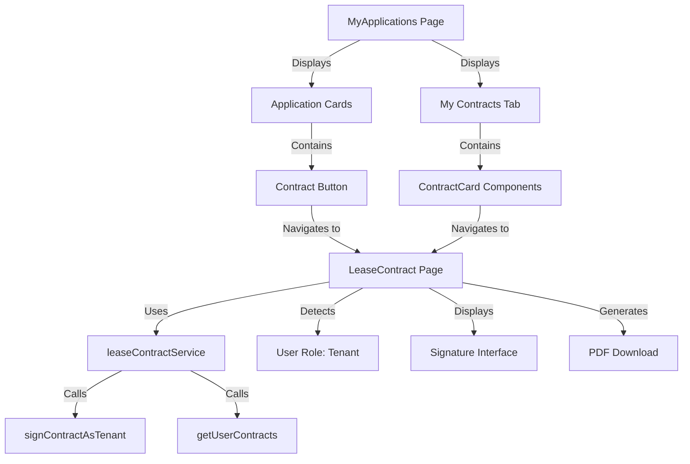

# Design Document: Tenant Contract Signature Workflow

## Overview

This design extends the existing contract management system to provide tenants with a complete workflow for viewing, signing, and downloading lease contracts. The implementation leverages existing infrastructure (leaseContractService, LeaseContract page, ContractCard component) and adds minimal new code to integrate contract access into the tenant's MyApplications page.

The design follows these key principles:
- **Reuse existing components**: Leverage LeaseContract page's role detection and ContractCard component
- **Minimal new code**: Add only UI elements and navigation logic
- **Consistent UX**: Match existing landlord contract workflow patterns
- **Security first**: Enforce access control at every contract access point

## Architecture

### System Components



### Data Flow

1. **Contract Discovery Flow**:
   - Tenant views MyApplications page
   - System loads applications via getUserApplications()
   - For each approved application, system checks for contract existence
   - System displays "Contract" button if contract exists and is not in draft status

2. **Contract Viewing Flow**:
   - Tenant clicks "Contract" button or views My Contracts tab
   - System navigates to /dashboard/contracts/{applicationId}
   - LeaseContract page loads contract via getLeaseContractByApplicationId()
   - System verifies user access via canUserAccessContract()
   - System detects user role as 'tenant'
   - System displays appropriate UI based on contract status

3. **Contract Signing Flow**:
   - Tenant reviews contract on LeaseContract page
   - If status is 'pending_tenant_signature', system displays signature interface
   - Tenant provides signature
   - System calls signContractAsTenant() with signature data
   - System updates contract status to 'fully_signed'
   - System displays success message and updated contract view

4. **Contract Download Flow**:
   - Tenant views fully signed contract
   - System displays download button
   - Tenant clicks download
   - System calls printOntarioLease() to generate PDF
   - Browser downloads PDF file

## Components and Interfaces

### Modified Components

#### 1. MyApplications Page (MyApplications.tsx)

**Modifications**:
- Add contract existence check in ProfessionalApplicationCard
- Add "Contract" button rendering logic
- Ensure My Contracts tab uses existing ContractCard component

**New Functions**:
```typescript
// Check if application has a signable contract
async function hasSignableContract(applicationId: string): Promise<boolean> {
  const contract = await getLeaseContractByApplicationId(applicationId);
  return contract !== null && contract.status !== 'draft';
}
```

**Modified Rendering**:
```typescript
// In ProfessionalApplicationCard component
{application.status === 'approved' && hasContract && (
  <Button
    variant="outline"
    size="sm"
    onClick={() => navigate(`/dashboard/contracts/${application.id}`)}
    className="h-8 text-xs flex items-center gap-1.5 bg-purple-50 border-purple-200 text-purple-700 hover:bg-purple-100 rounded px-3"
  >
    <FileText className="h-3.5 w-3.5" />
    Contract
  </Button>
)}
```

#### 2. LeaseContract Page (LeaseContract.tsx)

**No modifications needed** - The page already:
- Detects user role (landlord vs tenant)
- Displays appropriate signature interface
- Handles both landlord and tenant signatures
- Provides download functionality

**Existing Role Detection**:
```typescript
const role = contract.landlord_id === user!.id ? 'landlord' :
             contract.tenant_id === user!.id ? 'tenant' : null;
```

#### 3. ContractCard Component (in MyApplications.tsx)

**Already implemented** - The component:
- Displays contract details
- Shows status badges
- Provides "View" and "Review & Sign" buttons
- Handles download for fully signed contracts

### Service Layer

**No new service functions needed** - Using existing functions:
- `getLeaseContractByApplicationId(applicationId)` - Fetch contract
- `getUserContracts()` - Fetch all tenant contracts
- `signContractAsTenant(contractId, signatureData)` - Sign contract
- `canUserAccessContract(contractId, userId)` - Verify access
- `printOntarioLease(contract)` - Generate PDF

## Data Models

### Existing Models (No Changes)

#### LeaseContract
```typescript
interface LeaseContract {
  id: string;
  application_id: string;
  property_id: string;
  landlord_id: string;
  tenant_id: string;
  status: 'draft' | 'pending_landlord_signature' | 'pending_tenant_signature' | 'fully_signed' | 'executed';
  // ... other fields
}
```

#### OntarioLeaseContract
```typescript
interface OntarioLeaseContract extends LeaseContract {
  ontario_form_data: OntarioLeaseFormData;
  // ... other fields
}
```

### UI State Models

#### ApplicationWithContract
```typescript
interface ApplicationWithContract {
  application: Application;
  hasContract: boolean;
  contractStatus?: string;
}
```

This is a derived state used for rendering, not stored in database.

## Correctness Properties


*A property is a characteristic or behavior that should hold true across all valid executions of a system—essentially, a formal statement about what the system should do. Properties serve as the bridge between human-readable specifications and machine-verifiable correctness guarantees.*

### Property 1: Contract Button Visibility Rule
*For any* application in the tenant's applications list, the "Contract" button should be displayed if and only if the application status is 'approved' AND a contract exists for that application AND the contract status is not 'draft'.
**Validates: Requirements 1.1, 1.2, 1.3, 9.2**

### Property 2: Contract Navigation Correctness
*For any* contract button or contract action button (View, Review & Sign) clicked by a tenant, the system should navigate to /dashboard/contracts/{applicationId} where {applicationId} matches the application associated with that contract.
**Validates: Requirements 2.1, 8.4**

### Property 3: Role Detection Accuracy
*For any* contract accessed by a user, if the user's ID matches the tenant_id field on the contract, then the system should detect the user's role as 'tenant'.
**Validates: Requirements 3.1**

### Property 4: Status-Based UI Rendering
*For any* contract viewed by a tenant, the displayed UI should match the contract status: 'pending_tenant_signature' shows signature interface, 'pending_landlord_signature' shows read-only view with waiting message, 'fully_signed' shows signed contract with download options.
**Validates: Requirements 3.2, 3.3, 3.4**

### Property 5: Contract Details Display Completeness
*For any* contract displayed in the My Contracts tab, the rendered output should contain the property address, rent amount, lease dates, and landlord information.
**Validates: Requirements 4.3**

### Property 6: Contract List Ordering
*For any* list of contracts displayed to a tenant, the contracts should be ordered by creation date with the most recent contract first.
**Validates: Requirements 4.5**

### Property 7: Status Badge Display
*For any* contract displayed, a status badge should be present, and the badge text and styling should correspond to the contract status: 'pending_tenant_signature' → "Action Required: Sign" (amber), 'pending_landlord_signature' → "Waiting for Landlord" (blue), 'fully_signed' → "Signed & Active" (green), 'executed' → "Active Lease" (green).
**Validates: Requirements 5.1, 5.2, 5.3, 5.4, 5.5**

### Property 8: Download Button Visibility
*For any* contract displayed, a download button should be visible if and only if the contract status is 'fully_signed' OR 'executed'.
**Validates: Requirements 6.1, 8.3**

### Property 9: PDF Content Completeness
*For any* PDF generated from a fully signed contract, the PDF should contain all contract details (property address, rent amount, lease dates, terms) and both landlord and tenant signatures.
**Validates: Requirements 6.3**

### Property 10: Access Control Verification
*For any* contract access attempt by a user, the system should verify that the user's ID matches either the landlord_id or tenant_id on the contract before granting access.
**Validates: Requirements 7.1**

### Property 11: Unauthorized Access Handling
*For any* contract access attempt where the user is not authorized (user ID does not match landlord_id or tenant_id), the system should deny access, display an error message, and redirect to the dashboard.
**Validates: Requirements 7.2**

### Property 12: Contract Query Filtering
*For any* contract query executed by the system, the results should include only contracts where the authenticated user's ID matches either the landlord_id or tenant_id.
**Validates: Requirements 7.4**

### Property 13: Data Leakage Prevention
*For any* API response containing contract or application data, the response should not include IDs or details of contracts/applications where the requesting user is not a party.
**Validates: Requirements 7.5**

### Property 14: View Button Presence
*For any* contract displayed in the My Contracts tab, a "View" button should be present in the contract card.
**Validates: Requirements 8.1**

### Property 15: Review & Sign Button Visibility
*For any* contract with status 'pending_tenant_signature' displayed in the My Contracts tab, a "Review & Sign" button should be present with prominent styling.
**Validates: Requirements 8.2**

### Property 16: Contract Persistence and Retrieval
*For any* contract created in the system, the contract should appear in subsequent queries for the tenant's contracts after the next page load or refresh.
**Validates: Requirements 9.4**

## Error Handling

### Error Scenarios

1. **Contract Not Found**
   - Scenario: Tenant navigates to contract URL but contract doesn't exist
   - Handling: Display error toast "Contract not found" and redirect to /dashboard
   - Implementation: Check contract existence in LeaseContract page load

2. **Unauthorized Access**
   - Scenario: User attempts to access contract they're not a party to
   - Handling: Display error toast "You do not have permission to view this contract" and redirect to /dashboard
   - Implementation: Use existing canUserAccessContract() check

3. **Signature Failure**
   - Scenario: signContractAsTenant() call fails
   - Handling: Display error toast with specific error message, keep user on page to retry
   - Implementation: Wrap signature call in try-catch, display error.message

4. **Double Signature Attempt**
   - Scenario: Tenant tries to sign already-signed contract
   - Handling: Display info toast "You have already signed this contract"
   - Implementation: Check for existing tenant_signature before showing signature interface

5. **Network Errors**
   - Scenario: API calls fail due to network issues
   - Handling: Display error toast with retry option
   - Implementation: Catch network errors, provide "Retry" button that re-executes the failed operation

6. **PDF Generation Failure**
   - Scenario: printOntarioLease() fails to generate PDF
   - Handling: Display error toast "Failed to generate PDF. Please try again."
   - Implementation: Wrap PDF generation in try-catch

### Error Logging

All errors should be logged to console with context:
```typescript
console.error("Error context:", {
  operation: "signContract",
  contractId: contract.id,
  userId: user.id,
  error: error
});
```

## Testing Strategy

### Dual Testing Approach

This feature requires both unit tests and property-based tests to ensure comprehensive coverage:

**Unit Tests** focus on:
- Specific examples of contract button visibility logic
- Navigation behavior for known application IDs
- Error handling for specific failure scenarios (contract not found, unauthorized access)
- Edge cases like empty contract lists, missing data fields
- Integration between MyApplications page and LeaseContract page

**Property-Based Tests** focus on:
- Contract button visibility across all possible application and contract states
- Role detection for any user/contract combination
- Status badge rendering for all contract statuses
- Access control verification for any user/contract pair
- Contract list ordering for any set of contracts
- UI rendering correctness for all contract statuses

### Property-Based Testing Configuration

- **Library**: Use fast-check for TypeScript/React property-based testing
- **Iterations**: Minimum 100 iterations per property test
- **Tagging**: Each property test must reference its design document property
- **Tag Format**: `// Feature: tenant-contract-signature-workflow, Property {number}: {property_text}`

### Test Coverage Requirements

1. **Contract Button Visibility** (Property 1)
   - Generate random applications with various statuses
   - Generate random contracts with various statuses
   - Verify button appears only when all conditions met

2. **Navigation Correctness** (Property 2)
   - Generate random application IDs
   - Simulate button clicks
   - Verify navigation URL contains correct application ID

3. **Role Detection** (Property 3)
   - Generate random contracts with different landlord/tenant IDs
   - Test with various user IDs
   - Verify role detection matches tenant_id

4. **Status-Based UI** (Property 4)
   - Generate contracts with all possible statuses
   - Verify UI elements match expected state for each status

5. **Access Control** (Properties 10, 11, 12, 13)
   - Generate random user/contract pairs
   - Test authorized and unauthorized access attempts
   - Verify proper filtering and error handling

### Unit Test Examples

```typescript
describe('Contract Button Visibility', () => {
  it('should show contract button for approved application with non-draft contract', () => {
    const application = { id: '123', status: 'approved' };
    const contract = { application_id: '123', status: 'pending_tenant_signature' };
    expect(shouldShowContractButton(application, contract)).toBe(true);
  });

  it('should hide contract button for draft contract', () => {
    const application = { id: '123', status: 'approved' };
    const contract = { application_id: '123', status: 'draft' };
    expect(shouldShowContractButton(application, contract)).toBe(false);
  });

  it('should hide contract button for non-approved application', () => {
    const application = { id: '123', status: 'pending' };
    const contract = { application_id: '123', status: 'pending_tenant_signature' };
    expect(shouldShowContractButton(application, contract)).toBe(false);
  });
});

describe('Error Handling', () => {
  it('should display error and redirect when contract not found', async () => {
    // Mock getLeaseContractByApplicationId to return null
    // Verify error toast displayed
    // Verify navigation to /dashboard
  });

  it('should display error when unauthorized access attempted', async () => {
    // Mock canUserAccessContract to return false
    // Verify error toast displayed
    // Verify navigation to /dashboard
  });
});
```

### Integration Testing

Test the complete workflow:
1. Tenant views applications list → sees Contract button on approved application
2. Tenant clicks Contract button → navigates to LeaseContract page
3. Tenant reviews contract → sees signature interface
4. Tenant signs contract → contract status updates to fully_signed
5. Tenant views My Contracts tab → sees signed contract with download button
6. Tenant downloads PDF → receives complete PDF with signatures

## Implementation Notes

### Performance Considerations

1. **Contract Existence Checks**
   - Avoid N+1 queries when loading applications list
   - Consider fetching contracts in batch with applications
   - Cache contract existence status in application list state

2. **Contract List Loading**
   - getUserContracts() should use database indexes on tenant_id
   - Limit initial load to recent contracts (e.g., last 50)
   - Implement pagination if tenant has many contracts

3. **PDF Generation**
   - PDF generation is synchronous and may block UI
   - Consider showing loading indicator during generation
   - Cache generated PDFs if possible

### Security Considerations

1. **Access Control**
   - Always verify user authorization before displaying contract data
   - Use server-side checks (canUserAccessContract) not just client-side
   - Never expose contract IDs in URLs or responses for unauthorized users

2. **Signature Integrity**
   - Signature data includes timestamp, IP address, user agent
   - Signatures are immutable once recorded
   - Contract status transitions are one-way (can't un-sign)

3. **Data Privacy**
   - Contract queries filter by authenticated user ID
   - API responses include only authorized data
   - Error messages don't leak information about other users' contracts

### UI/UX Considerations

1. **Visual Consistency**
   - Contract button styling matches existing action buttons
   - Status badges use consistent color scheme
   - Contract cards match application card styling

2. **User Feedback**
   - Loading states during contract fetch
   - Success toasts after signature
   - Clear error messages with actionable guidance

3. **Mobile Responsiveness**
   - Contract button works on mobile layouts
   - Contract cards stack properly on small screens
   - Signature interface is mobile-friendly

### Accessibility

1. **Keyboard Navigation**
   - All buttons accessible via keyboard
   - Tab order is logical
   - Enter key activates buttons

2. **Screen Readers**
   - Status badges have aria-labels
   - Buttons have descriptive labels
   - Error messages are announced

3. **Visual Indicators**
   - Status badges use both color and text
   - Icons supplement text labels
   - Sufficient color contrast

## Dependencies

### Existing Services
- `leaseContractService.ts` - All contract operations
- `rentalApplicationService.ts` - Application queries
- `ontarioLeaseService.ts` - Ontario-specific contract operations

### Existing Components
- `LeaseContract.tsx` - Contract viewing and signing page
- `ContractCard` - Contract display component (in MyApplications.tsx)
- `StatusBadge` - Status indicator component (in MyApplications.tsx)

### Existing Utilities
- `printOntarioLease()` - PDF generation utility

### External Libraries
- React Router - Navigation
- Sonner - Toast notifications
- Lucide React - Icons

## Migration and Rollout

### Phase 1: UI Updates
1. Add contract button to ProfessionalApplicationCard
2. Verify My Contracts tab displays contracts correctly
3. Test navigation to LeaseContract page

### Phase 2: Testing
1. Add unit tests for button visibility logic
2. Add property-based tests for access control
3. Perform integration testing of complete workflow

### Phase 3: Deployment
1. Deploy to staging environment
2. Perform manual testing with test tenant accounts
3. Verify contract signing workflow end-to-end
4. Deploy to production

### Rollback Plan
If issues arise:
1. Hide Contract button via feature flag
2. Revert MyApplications.tsx changes
3. Existing contract functionality remains intact (no breaking changes)

## Future Enhancements

1. **Real-time Updates**
   - WebSocket notifications when contract status changes
   - Auto-refresh contract list when new contract available

2. **Email Notifications**
   - Email tenant when contract ready for signature
   - Email confirmation after tenant signs

3. **Contract History**
   - Show contract version history
   - Track all status changes with timestamps

4. **Bulk Operations**
   - Download multiple contracts at once
   - Filter contracts by status, date range

5. **Mobile App**
   - Native mobile signature capture
   - Push notifications for contract updates
